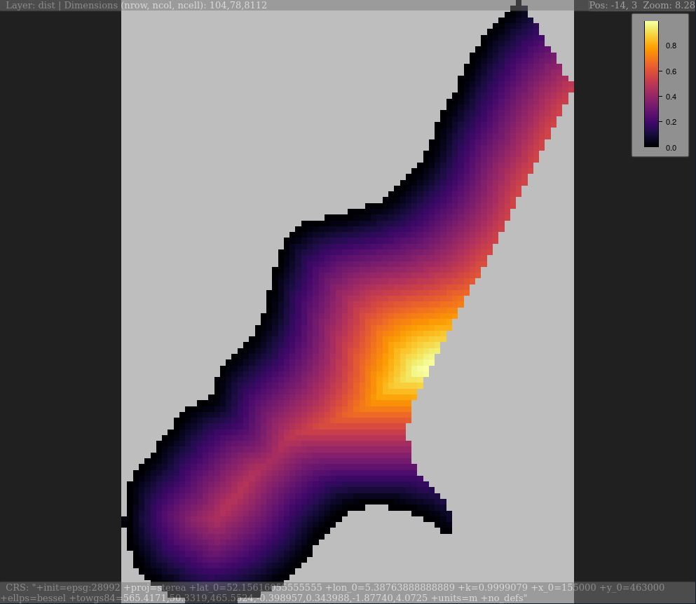

<!-- README.md is generated from README.Rmd. Please edit that file -->

```{r setup, include = FALSE}
knitr::opts_chunk$set(
  collapse = TRUE,
  eval = FALSE,
  comment = "#>",
  fig.path = "man/figures/README-",
  out.width = "100%"
)
```

# plainview - Interactively Explore (Raster)Images

[](https://cran.r-project.org/package=plainview)
[](https://travis-ci.org/r-spatial/plainview)
[](https://www.rpackages.io/package/plainview) 
[](https://www.rpackages.io/package/plainview)
[](https://cran.r-project.org/package=plainview)

`plainview` enables interactive exploration of (raster)images. Images will be 
rendered on a plain HTML canvas (hence the name of the package). For spatial data
this means that rendering is not restricted to a certain projection (e.g. web
mercator for leaflet or mapview) but rendering is projection independent. It also 
means that it is possible to plot large images made up of millions of pixels.

## Installation

You can install the released version of `plainview` from [CRAN](https://CRAN.R-project.org) with:

```{r, eval=FALSE}
install.packages("plainview")
```

## Example

```{r, eval=FALSE}
### raster data ###
library(sp)
library(raster)

data(meuse.grid)
coordinates(meuse.grid) = ~x+y
proj4string(meuse.grid) <- CRS("+init=epsg:28992")
gridded(meuse.grid) = TRUE
meuse_rst <- stack(meuse.grid)

# SpatialPixelsDataFrame
plainView(meuse.grid, zcol = "dist")
```



### Code of Conduct

Please note that the 'plainview' project is released with a [Contributor Code of Conduct](CODE_OF_CONDUCT.md). By participating in this project you agree to abide by its terms.

