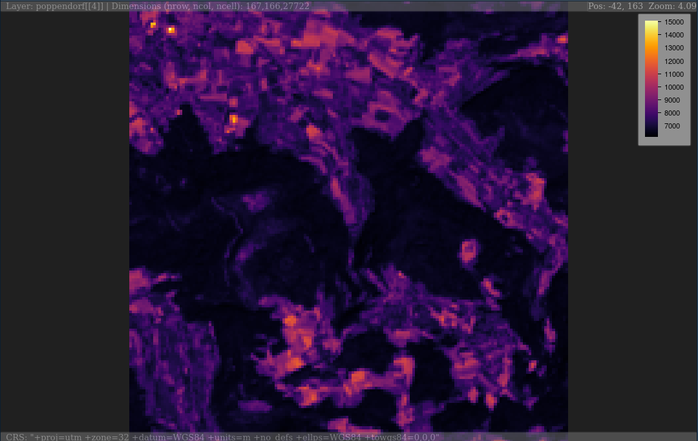
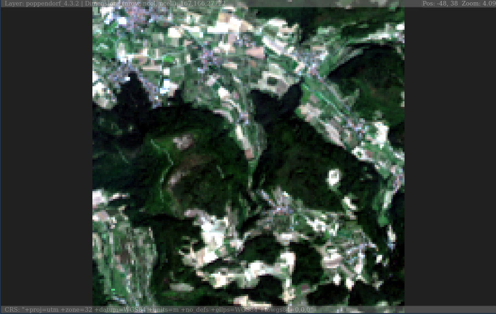
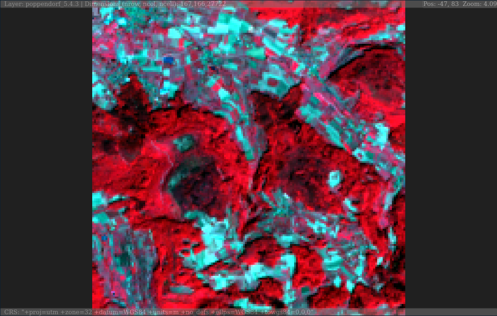

<!-- README.md is generated from README.Rmd. Please edit that file -->

# plainview - Interactively Explore (Raster)Images

[](https://travis-ci.org/r-spatial/plainview)


[](https://cran.r-project.org/package=plainview)
[](https://CRAN.R-project.org/package=plainview)

`plainview` enables interactive exploration of (raster)images. Images
will be rendered on a plain HTML canvas (hence the name of the package).
For spatial data this means that rendering is not restricted to a
certain projection (e.g. web mercator for leaflet or mapview) but
rendering is projection independent. It also means that it is possible
to plot large images made up of millions of pixels.

## Installation

You can install the released version of `plainview` from
[CRAN](https://CRAN.R-project.org) with:

``` r
install.packages("plainview")
```

## Example

``` r
# RasterLayer
plainView(poppendorf[[4]])
```



``` r
# RasterStack
plainview(poppendorf, r = 4, g = 3, b = 2) # true color
```



``` r
plainview(poppendorf, r = 5, g = 4, b = 3) # false color
```



### Code of Conduct

Please note that the ‘plainview’ project is released with a [Contributor
Code of
Conduct](https://github.com/r-spatial/plainview/blob/master/CODE_OF_CONDUCT.md).
By participating in this project you agree to abide by its terms.
